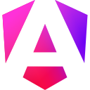
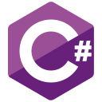
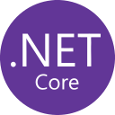

<div align="center">

```bash
$ whoami
```

# YEHUDIT

```js
const role = "Full-Stack Developer";
const mission = "Turning ideas into working solutions.";
```

</div>

---

## `// About Me`

```yaml
curiosity: high
learning_speed: fast
approach: proactive
mindset: "understand the problem, find the right solution, keep improving"
currently: exploring new technologies across the stack
```

I'm a Full-Stack Developer with a strong curiosity for technology and a passion for turning ideas into practical solutions.

I'm a fast learner, proactive by nature, and enjoy taking on challenges that push me to grow and think creatively.

I believe good development is not only about writing code — it's about understanding the problem, finding the right solution, and continuously looking for ways to improve it.

---

## `// Tech Stack`

```
Frontend   → Angular · React · TypeScript · JavaScript · SCSS · HTML
Backend    → C# · .NET · Node.js · Python · Java
Databases  → SQL Server · Oracle · MongoDB
Tools      → Git · GitHub · Azure DevOps · Postman
```

<p align="center">
  
  
  
  
  
  
  &nbsp;&nbsp;
  
  
  
  
  
  &nbsp;&nbsp;
  
  
  
  &nbsp;&nbsp;
  
  
  
  
</p>

---

```bash
$ echo "From ideas to code, from code to solutions."
From ideas to code, from code to solutions.

$ cat next-steps.md
> Check out my pinned repositories below for project details 📌
```
